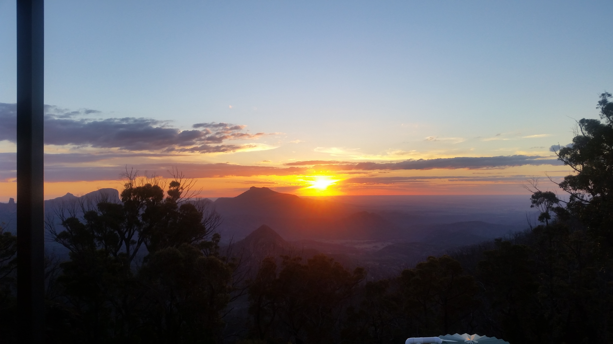
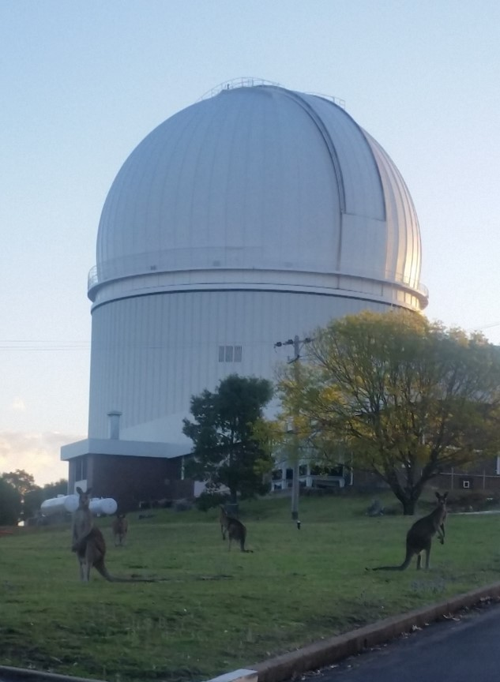

I am Janie Hoormann: data scientist, astrophysicist, science communicator, traveler, baker, and pianist. I spent most of my life in St. Louis, Missouri, but I have moved around a few times over the years.  While not intentional those moves did tend to be big ones!  My family lived in Auckland, New Zealand for a couple of years when I was a child before moving back to St. Louis.  I stayed in St. Louis for a while and then went to college in Texas and am currently living in Brisbane, Australia.   When I moved down to Australia everyone warned me about the snakes and spiders that could kill you.  What I learned was that it isn’t the snakes and spiders you need to worry about.  The birds are the problem, they can be mean!

*The sunset from the Siding Springs Observatory surrounded by the Warrumbungle National Park in New South Wales.  I think this is my favorite place I have been to in Australia.  For an observational astronomer this sunset indicates it is about time to get to work!* 

Where it all began
======
In 2008 I moved down to Waco, Texas, to study at Baylor University.  I always enjoyed physics and math so I decided to major in both.  I was always particularly interested in astrophysics though, so when they decided to offer an astrophysics degree right after I started I jumped at the chance.  This made me the first astrophysics major to graduate from Baylor.   I got connected into a research group early on and spent a summer researching if a newly proposed theory of quantum gravity could explain the gravitational effects observed in our solar system.  I also had the opportunity to go to the University of Notre Dame in the summer of 2011 as part of the National Science Foundation’s research experience for undergraduates program to model how the dynamics of the gas between stars is affected by the explosions of supernova.  While I majored in math as well, I realized that I preferred using math as a tool to describe the world around me, as one regularly does when studying physics.  Therefore, when it came time to pick what graduate programs I would apply to I decided to stick with physics.  

Going into the black hole
======
In 2012 I moved back to my hometown to start my PhD in physics at Washington University in St. Louis.  I have heard some describe their PhD as a black hole, sucking in all of their time and energy, but for me that metaphor became a bit more literal!  My research focused on how we could use black holes as a laboratory to test Albert Einstein’s theory of general relativity in the strongest gravitational fields we can find.  I focussed on the theory side of things, doing numerical simulations of the light emitted from the accretion disks that surround black holes.  I could then tweak how gravity behaves and predict what that would mean for us observing these sources here on earth.  These simulations showed that despite the fact that the difference in observables when you assume different theories of gravity are small, you can still put some strong constraints from how far away from Einstein’s theory you can get before you can’t reproduce what we observe.  I was also a part of a proposal for a space borne X-ray polarimetry mission.  As black holes were the key science targets, I did the simulations to predict how well we could use data from such a mission to measure the properties of black holes and their immediate surroundings.  

While I primarily worked on numerical simulations, I also dabbled in instrumentation as part of the balloon borne hard X-ray polarimetry experiment, X-Calibur.  An aluminium/carbon fiber truss holds the mirror and polarimeter in place during the flight.  The design of this truss is particularly important because the mirror has an 8 m focal length but needs to focus the light on a scattering element that is only 13 mm in diameter.  I was able to determine how the truss was likely to deform due to thermal contractions given the conditions expected during flight to ensure the truss would remain in shape throughout the flight.  I also worked on a system to track any deformations the truss might experience during the flight.  X-Calibur just completed its long duration flight in Antarctica this January!

*My parents and me at my PhD hooding ceremony at Washington University in St. Louis, May 2016.* 

Moving down under
======
The summer of 2016 (or winter for those in the southern hemisphere!) proved to be very busy.  I successfully defended my PhD dissertation at the end of June! Then I had just over a month to wrap everything up at school and pack up my apartment before I was on a plane moving across the world to Brisbane, Australia.  I had accepted a job offer as a postdoctoral research fellow at the University of Queensland.  While still focusing on black holes, this time I would be studying them using observational data as part of the Australian Dark Energy Survey (OzDES).  I was hired to spearhead the OzDES Reverberation Mapping program.  Reverberation Mapping is a technique which allows you to measure the mass of the supermassive black holes found in the centers of active galaxies through the use of a time series analysis.  These are black holes millions to billions of times more massive than our sun.  This is done by regularly observing a particular galaxy and measuring how the light emitted nearby the black hole echoes around its surroundings.   In order to do this OzDES regularly observed 771 galaxies over its 6 years of observations on the 4 meter optical Anglo Australian Telescope (AAT) in Coonabarabran, New South Wales.  These galaxies are up to 12 billion light years away from us making them some of the most distant black holes we will be able to directly measure the mass for, which will provide a way to study how these black holes have evolved over time.  I was hired to develop the calibration and analysis pipelines so we can use this data to measure the black hole masses.  OzDES just completed its final year of observations this January and submitted the paper with our first black hole mass measurements!  

*The Anglo Australian Telescope at Siding Springs Observatory, NSW Australia.  Around dusk kangaroos can often be seen guarding the telescope!*

What I want to do with my life
======
While the theme of my research has stayed around black holes, I am fortunate that I have had many opportunities to gain experience in the three main branches of astrophysics research: simulations, instrumentation, and data analysis.  It was during my current role that I learned what I get the most excited about is the data analysis.  One of my favorite problems I had to solve was how to best calibrate the data we obtained from the AAT.  I had to isolate where the variations we were observing in our data came from (were they observationally or instrument induced) and how to account for them.  I was able to determine the variations we observed were primarily due to observational/atmospheric conditions and developed a method to calibrate our data to compensate for it.  This calibration is so effective that the noise of the resulting data is on par with the hard limit we could expect based on the noise of the detectors themselves.  What I really enjoyed was digging through all of this data to really understand what was going into it and extracting a meaningful solution that wasn’t just useful to my project but to anyone who needs to calibrate this kind of data.  I also realized that these types of problems, where you need to extract useful information from a large amount of messy data, are not just prevalent in astrophysics and the academic world.   There are many places where I could do what it is I enjoy the most, putting what I have learned during my academic career to use for a much wider community.  
